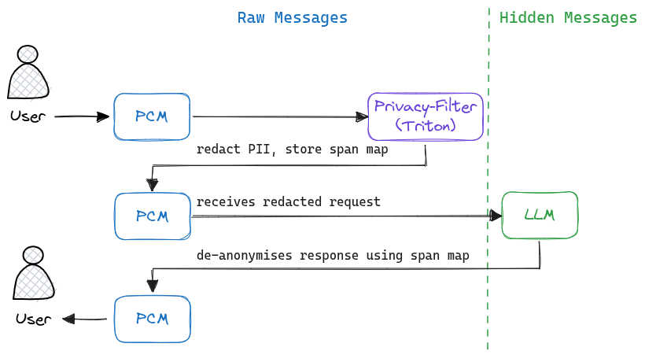

# Pnyx-privacy-filter

Privacy-filtering stack for LLM deployments. PII is detected and redacted before messages reach the LLM; responses are de-anonymised before being returned to the client.

## Components

| Component | Path | Description |
|---|---|---|
| **Triton service** | [`docker/triton/`](docker/triton/README.md) | Containerised [`openai/privacy-filter`](https://huggingface.co/openai/privacy-filter) model served via Triton Inference Server |
| **Model repository** | [`model_repository/pnyx-pf/`](model_repository/pnyx-pf/README.md) | Triton ensemble: tokenizer → ONNX model → postprocessing pipeline |
| **PrivateChatManager (PCM)** | [`docker/pcm/`](docker/pcm/README.md) · [`private_chat_manager/`](private_chat_manager/README.md) | OpenAI-compatible proxy that drives the redact → forward → de-anonymise flow |
| **Examples** | [`examples/`](examples/README.md) | Docker Compose stack to run the full system |

## Data flow




## PCM Features:
- OpenAI-compatible API (currently only `v1/chat/completions`, but to be extended in future)
- Streaming (`stream: true`) with real-time de-anonymisation of `content`, `reasoning`, and streamed tool-call arguments
- Session tracking with span maps for accurate de-anonymisation of LLM responses
- Tool/function response support.
- PCM maintains the same placeholder map for the entire session, so if a response contains PII that maps to an existing placeholder, the LLM will see the placeholder rather than the raw text. This allows the LLM to refer to previously redacted entities by their placeholders, improving consistency across turns and tools.

## Quick start

### Docker

1. Build the Triton image as detailed in [docker/triton/README.md](docker/triton/README.md).
2. Build the PCM image as detailed in [docker/pcm/README.md](docker/pcm/README.md).
3. Configure `.env` in the `examples/` and start the stack as detailed in [examples/README.md](examples/README.md).

```bash
cd examples/
cp sample.env .env   # edit with your values
docker compose up -d
```
> For a more in depth guide, please refer to [examples/README.md](examples/README.md) for prerequisites, image builds, and configuration.

## Limitations:
Beside the limitations of the underlying `privacy-filter` model (see [openai/privacy-filter#bias-risks-and-limitations](https://huggingface.co/openai/privacy-filter#bias-risks-and-limitations)) it can be noted that:

- Text-only: The current system only redacts PII in text form. PII embedded in images, PDFs, or other file formats is not currently supported.
- Tool/function response support is basic: Despite PCM's ability to anonymise/de-anonymise tool responses, the underlying model is not specifically trained for structured data and may produce inconsistent results.


## License & attribution

This project includes derivative works of [openai/privacy-filter](https://github.com/openai/privacy-filter) (Apache 2.0, Copyright 2026 OpenAI, Inc.). See [NOTICE](NOTICE) for details.

